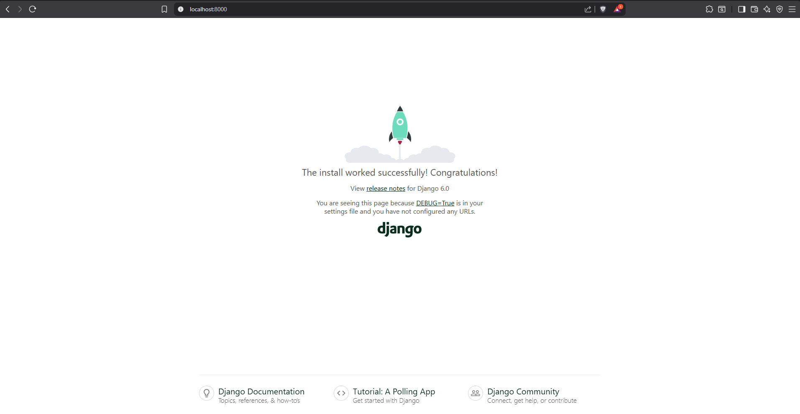
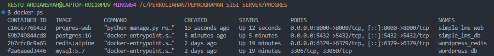
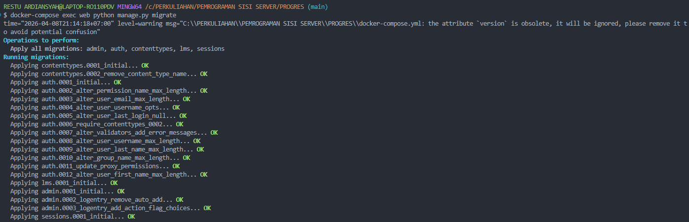
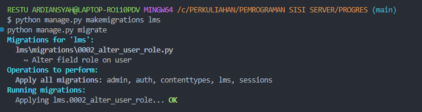

# Simple LMS — Extended Backend

Final Project mata kuliah **Pemrograman Sisi Server (A11.54403)** — Teknik Informatika, Universitas Dian Nuswantoro.

Project ini adalah backend **Learning Management System (LMS)** yang dibangun dengan **Django + Django Ninja**, dilengkapi autentikasi JWT, role-based access control, caching Redis, activity logging ke MongoDB, background task via Celery, serta beberapa fitur tambahan (announcement, dashboard, response format konsisten, dan health check).

---

## Daftar Isi

1. [Tech Stack](#tech-stack)
2. [Fitur Wajib (Fondasi)](#fitur-wajib-fondasi)
3. [Fitur Tambahan yang Dipilih](#fitur-tambahan-yang-dipilih)
4. [Cara Menjalankan Project](#cara-menjalankan-project)
5. [Akun Demo](#akun-demo)
6. [Endpoint Penting](#endpoint-penting)
7. [Tutorial Pengujian Tiap Fitur Tambahan](#tutorial-pengujian-tiap-fitur-tambahan)
8. [Struktur Project](#struktur-project)
9. [Riwayat Pengembangan (Progress Sebelumnya)](#riwayat-pengembangan-progress-sebelumnya)

---

## Tech Stack

| Komponen | Teknologi |
|---|---|
| Bahasa & Framework | Python 3.12, Django 6, Django Ninja + Ninja Extra |
| Database | PostgreSQL |
| Autentikasi | JWT (django-ninja-jwt) |
| Caching | Redis |
| NoSQL / Analytics | MongoDB |
| Message Broker & Task Queue | RabbitMQ + Celery (worker & beat) |
| Task Monitoring | Flower |
| Kontainerisasi | Docker & Docker Compose |
| Dokumentasi API | Swagger / OpenAPI (`/api/docs`) |

---

## Fitur Wajib (Fondasi)

| Item Wajib | Poin | Status |
|---|---|---|
| Project dapat dijalankan dengan Docker Compose | 5 | ✅ Selesai |
| Database PostgreSQL berjalan dan migration berhasil | 4 | ✅ Selesai |
| Authentication JWT berjalan | 4 | ✅ Selesai |
| Role admin, instructor, student diterapkan dengan benar | 4 | ✅ Selesai |
| Endpoint course, lesson, enrollment, progress berjalan | 5 | ✅ Selesai |
| README berisi cara menjalankan, akun demo, dan endpoint utama | 4 | ✅ Selesai |
| Swagger/OpenAPI dapat diakses | 2 | ✅ Selesai |
| Struktur project rapi, tidak hardcode konfigurasi sensitif | 2 | ✅ Selesai |
| **Total** | **30** | |

---

## Fitur Tambahan yang Dipilih

| No | Fitur | Kategori | Poin | Status |
|---|---|---|---|---|
| 1 | Response dan Error Format Konsisten | I. API Quality & Developer Experience | 10 | ✅ Selesai |
| 2 | Health Check dan API Changelog | K. Deployment & Production Readiness | 8 | ✅ Selesai |
| 3 | Course Announcement System | M. Business Feature Tambahan | 10 | ✅ Selesai |
| 4 | Student Dashboard | A. Course & Learning Experience | 12 | ✅ Selesai |
| 5 | Instructor Dashboard | A. Course & Learning Experience | 12 | ✅ Selesai |
| | **Total** | | **52** | |

> Total 52 poin masuk kategori "sangat baik" sesuai rekomendasi soal (45–60 poin). Nilai fitur tambahan tetap dibatasi maksimal 50 poin sesuai ketentuan.

---

## Cara Menjalankan Project

### 1. Clone repository & masuk ke folder project

```bash
git clone <url-repo-ini>
cd PROGRES
```

### 2. Siapkan file environment

```bash
cp .env.example .env
```

File `.env` sudah berisi konfigurasi default yang cocok untuk Docker Compose (tidak perlu diubah kecuali mau custom).

### 3. Build & jalankan seluruh service

```bash
docker compose up -d --build
```

Ini akan menjalankan 8 service: `web` (Django), `db` (PostgreSQL), `redis`, `mongodb`, `rabbitmq`, `celery-worker`, `celery-beat`, dan `flower`.

### 4. Pastikan semua service sudah berjalan

```bash
docker compose ps
```

Semua service harus berstatus `Up` / `running`.

### 5. Jalankan migration

```bash
docker compose exec web python manage.py migrate
```

### 6. (Opsional) Buat superuser untuk akses Django Admin

```bash
docker compose exec web python manage.py createsuperuser
```

### 7. Akses aplikasi

| Layanan | URL |
|---|---|
| Swagger API Docs | http://localhost:8000/api/docs |
| Django Admin | http://localhost:8000/admin/ |
| Flower (monitoring Celery) | http://localhost:5555 |
| RabbitMQ Management | http://localhost:15672 (user/pass default: `guest`/`guest`) |

### Menghentikan project

```bash
docker compose down
```

---

## Akun Demo

Akun demo dibuat lewat endpoint `POST /api/auth/register`. Contoh langkah cepat via `curl` untuk membuat 1 akun admin, 1 instructor, 1 student:

```bash
# Instructor
curl -X POST http://localhost:8000/api/auth/register \
  -H "Content-Type: application/json" \
  -d '{"username":"instructor1","email":"instructor1@lms.com","password":"instructor123","role":"instructor"}'

# Student
curl -X POST http://localhost:8000/api/auth/register \
  -H "Content-Type: application/json" \
  -d '{"username":"student1","email":"student1@lms.com","password":"student123","role":"student"}'
```

Untuk akun **admin**, buat lewat `createsuperuser` (langkah 6 di atas), lalu login lewat endpoint JWT seperti biasa (role admin sudah otomatis kalau dibuat via `createsuperuser`, atau bisa diubah manual lewat Django Admin di `/admin/` pada model User).

| Role | Username | Password |
|---|---|---|
| Instructor | `instructor1` | `instructor123` |
| Student | `student1` | `student123` |
| Admin | *(sesuai input saat `createsuperuser`)* | *(sesuai input saat `createsuperuser`)* |

---

## Endpoint Penting

Semua endpoint berada di bawah prefix `/api`. Dokumentasi interaktif lengkap ada di `/api/docs`.

### Auth
| Method | Endpoint | Keterangan | Perlu Login? |
|---|---|---|---|
| POST | `/api/auth/register` | Registrasi user baru | – |
| POST | `/api/token/pair` | Login, dapat access & refresh token | – |
| POST | `/api/token/refresh` | Refresh access token | – |
| GET | `/api/auth/me` | Lihat profil sendiri | ✅ |
| PUT | `/api/auth/me` | Update profil sendiri | ✅ |

### Courses
| Method | Endpoint | Keterangan | Perlu Login? |
|---|---|---|---|
| GET | `/api/courses` | List semua course (cache Redis) | – |
| GET | `/api/courses/{id}` | Detail course (cache Redis) | – |
| POST | `/api/courses` | Buat course baru | ✅ (Instructor) |
| PATCH | `/api/courses/{id}` | Update course (harus pemilik) | ✅ (Instructor) |
| DELETE | `/api/courses/{id}` | Hapus course | ✅ (Admin) |

### Enrollments & Progress
| Method | Endpoint | Keterangan | Perlu Login? |
|---|---|---|---|
| POST | `/api/enrollments?course_id={id}` | Enroll ke course | ✅ (Student) |
| GET | `/api/enrollments/my-courses` | List course yang diikuti | ✅ (Student) |
| POST | `/api/enrollments/{lesson_id}/progress` | Tandai lesson selesai | ✅ (Student) |

### Announcements (Fitur Tambahan)
| Method | Endpoint | Keterangan | Perlu Login? |
|---|---|---|---|
| POST | `/api/courses/{course_id}/announcements` | Buat pengumuman (harus pemilik course) | ✅ (Instructor) |
| GET | `/api/courses/{course_id}/announcements` | Lihat pengumuman (harus enrolled/pemilik/admin) | ✅ |
| PATCH | `/api/announcements/{id}` | Update pengumuman (harus pemilik) | ✅ (Instructor) |
| DELETE | `/api/announcements/{id}` | Hapus pengumuman (harus pemilik) | ✅ (Instructor) |

### Dashboard (Fitur Tambahan)
| Method | Endpoint | Keterangan | Perlu Login? |
|---|---|---|---|
| GET | `/api/dashboard/student` | Ringkasan course aktif, progress, rekomendasi, pengumuman terbaru | ✅ (Student) |
| GET | `/api/dashboard/instructor` | Statistik course, enrollment, course terpopuler, jumlah pengumuman | ✅ (Instructor) |

### System (Fitur Tambahan)
| Method | Endpoint | Keterangan | Perlu Login? |
|---|---|---|---|
| GET | `/api/health` | Cek status Database, Redis, MongoDB | – |
| GET | `/api/changelog` | Riwayat perubahan API per versi | – |

### Analytics
| Method | Endpoint | Keterangan | Perlu Login? |
|---|---|---|---|
| GET | `/api/analytics/report` | Laporan agregasi learning analytics dari MongoDB | ✅ (Admin) |

---

## Tutorial Pengujian Tiap Fitur Tambahan

Semua pengujian dilakukan lewat **Swagger UI**, cukup dari browser tanpa perlu tools tambahan.

**Buka:** `http://localhost:8000/api/docs`

Halaman ini menampilkan daftar endpoint yang dikelompokkan per tag: **Auth**, **Courses**, **Enrollments**, **Announcements**, **Dashboard**, **System**, **Analytics**.

---

### Langkah 0 — Buat Akun Instructor & Student

> Lewati bagian ini kalau akun demo (lihat [Akun Demo](#akun-demo)) sudah dibuat.

1. Di halaman Swagger, cari grup **Auth**, klik `POST /api/auth/register` untuk membuka detailnya.
2. Klik tombol **"Try it out"** (ada di kanan atas kotak endpoint).
3. Kotak **Request body** akan menjadi bisa diedit. Hapus isi default, ganti dengan:
   ```json
   {
     "username": "instructor1",
     "email": "instructor1@lms.com",
     "password": "instructor123",
     "role": "instructor"
   }
   ```
4. Klik tombol **"Execute"** (tombol biru besar di bawah kotak body).
5. Scroll ke bawah ke bagian **Server response** → **Response body**. Kalau berhasil, akan muncul status **`201`** dan `"success": true`.
6. Ulangi langkah 2–5 untuk membuat akun student, ganti body-nya:
   ```json
   {
     "username": "student1",
     "email": "student1@lms.com",
     "password": "student123",
     "role": "student"
   }
   ```

---

### Langkah 0.5 — Cara Login & Authorize (Wajib Sebelum Tes Fitur yang Butuh Login)

Ini akan sering diulang tiap ganti akun (instructor ↔ student), jadi pahami dulu alurnya.

1. Cari endpoint `POST /api/token/pair` (biasanya di bagian paling atas Swagger, sebelum grup Auth).
2. Klik **"Try it out"**.
3. Isi Request body dengan akun yang mau dipakai, contoh:
   ```json
   {
     "username": "instructor1",
     "password": "instructor123"
   }
   ```
4. Klik **"Execute"**.
5. Di **Response body**, cari field `"access"` — isinya teks panjang berawalan `eyJ...`. **Copy seluruh isi teks itu** (tanpa tanda kutip di awal/akhir).
6. Scroll ke **paling atas halaman** Swagger (bukan di dalam endpoint). Di pojok kanan atas, cari tombol dengan **ikon gerbang/gembok** bertuliskan **"Authorize"**.
7. Klik tombol **"Authorize"** tersebut → akan muncul jendela popup di tengah layar.
8. Di kotak input popup, ketik `Bearer ` (ada spasi setelah kata "Bearer") lalu **paste** token yang tadi di-copy. Hasil akhirnya harus terlihat seperti:
   ```
   Bearer eyJhbGciOiJIUzI1NiIsInR5cCI6IkpXVCJ9...
   ```
9. Klik tombol **"Authorize"** yang ada **di dalam popup** tersebut.
10. Klik **"Close"** untuk menutup popup.

✅ Sekarang semua endpoint yang butuh login akan otomatis memakai token ini.

> ⚠️ **Token berlaku singkat (default 5 menit).** Kalau muncul error `401` dengan pesan `"Token is invalid or expired"`, itu tandanya token sudah kedaluwarsa — ulangi langkah 1–10 di atas untuk dapat token baru.
>
> **Ganti akun?** Kalau tadinya login sebagai instructor lalu mau pindah ke student (atau sebaliknya), ulangi seluruh langkah 1–10 di atas dengan akun yang baru. Token lama otomatis tergantikan begitu kamu klik "Authorize" lagi di langkah 9.

---

### Fitur 1 — Response dan Error Format Konsisten

**Tujuan:** membuktikan semua response (sukses & gagal) punya struktur `success`, `message`, `data`/`errors` yang seragam.

1. Login & Authorize sebagai **student** (ikuti Langkah 0.5 dengan akun `student1`).
2. Cari grup **Courses**, buka `POST /api/courses`, klik **"Try it out"**.
3. Isi Request body bebas, contoh:
   ```json
   {
     "title": "Testing Course",
     "description": "Percobaan"
   }
   ```
4. Klik **"Execute"**.
5. **Hasil yang diharapkan:** status **`403`**, dan Response body persis seperti ini (bukan HTML error atau traceback Django):
   ```json
   {
     "success": false,
     "message": "Akses ditolak: khusus instructor",
     "errors": null
   }
   ```
6. Sebagai pembanding, buka `GET /api/courses`, klik **"Try it out"** → **"Execute"** (endpoint ini tidak butuh login). Perhatikan format response-nya tetap punya `success`, `message`, `data` — sama-sama konsisten walau ini kasus sukses.

---

### Fitur 2 — Health Check dan API Changelog

**Tujuan:** membuktikan sistem bisa memantau status Database, Redis, dan MongoDB secara real-time.

1. Cari grup **System**, buka `GET /api/health`.
2. Klik **"Try it out"** → langsung klik **"Execute"** (endpoint publik, tidak perlu login/Authorize).
3. **Hasil yang diharapkan:** status **`200`**, dan Response body:
   ```json
   {
     "success": true,
     "message": "Health check berhasil",
     "data": {
       "status": "healthy",
       "services": {
         "database": "up",
         "redis": "up",
         "mongodb": "up"
       }
     }
   }
   ```
4. **Bukti tambahan (opsional tapi disarankan untuk laporan):** buka terminal baru (jangan tutup yang lain), jalankan:
   ```bash
   docker compose stop mongodb
   ```
5. Balik ke Swagger, klik **"Execute"** lagi di `/api/health`. Sekarang harus muncul status **`503`** dan `"mongodb": "down (...)"` — membuktikan endpoint ini benar-benar mengecek koneksi, bukan cuma selalu bilang "sehat".
6. Nyalakan lagi service-nya:
   ```bash
   docker compose start mongodb
   ```
7. Cari `GET /api/changelog`, klik **"Try it out"** → **"Execute"**. Harus muncul daftar riwayat versi (`1.1.0` dan `1.0.0`) beserta detail perubahannya.

---

### Fitur 3 — Course Announcement System

**Tujuan:** membuktikan instructor bisa membuat pengumuman, dan hanya student yang sudah enroll yang bisa melihatnya.

**Bagian A — Instructor membuat course & pengumuman**

1. Login & Authorize sebagai **instructor** (`instructor1`).
2. Buka `POST /api/courses`, klik **"Try it out"**, isi body:
   ```json
   {
     "title": "Belajar Python Dasar",
     "description": "Kursus pemrograman Python untuk pemula"
   }
   ```
3. Klik **"Execute"**. Di Response body, cari dan **catat angka** pada `"data": {"id": ...}` (misal muncul `1`) — ini `course_id` yang dipakai di langkah berikutnya.
4. Cari grup **Announcements**, buka `POST /api/courses/{course_id}/announcements`, klik **"Try it out"**.
5. Akan muncul kolom input terpisah bernama **course_id** (di atas kotak Request body) — isi dengan angka dari langkah 3 (misal `1`).
6. Di Request body, isi:
   ```json
   {
     "title": "Kelas Dimulai Minggu Depan",
     "content": "Jangan lupa siapkan laptop sebelum kelas dimulai."
   }
   ```
7. Klik **"Execute"**. **Hasil yang diharapkan:** status **`201`**, `"success": true`.

**Bagian B — Student yang belum enroll dicoba akses (harus ditolak)**

8. Login & Authorize ulang, ganti ke akun **student** (`student1`) — ikuti Langkah 0.5 dari awal.
9. Buka `GET /api/courses/{course_id}/announcements`, klik **"Try it out"**, isi `course_id` dengan angka yang sama (`1`), klik **"Execute"**.
10. **Hasil yang diharapkan:** status **`403`**, pesan `"Kamu harus terdaftar di course ini untuk melihat pengumuman"`.

**Bagian C — Student enroll, lalu coba lagi (harus berhasil)**

11. Buka `POST /api/enrollments` di grup **Enrollments**, klik **"Try it out"**.
12. Isi kolom **course_id** dengan `1`, klik **"Execute"**. **Hasil yang diharapkan:** status **`201`**, `"success": true`.
13. Ulangi langkah 9 (`GET /api/courses/1/announcements`) → sekarang harus status **`200`** dan pengumuman yang dibuat instructor tadi muncul di `data`.

---

### Fitur 4 — Student Dashboard

**Tujuan:** membuktikan student bisa melihat ringkasan course aktif, progress belajar, dan pengumuman terbaru dalam satu endpoint.

1. Pastikan masih Authorize sebagai **student** yang sudah enroll (lanjutan dari Fitur 3, Bagian C).
2. **(Opsional, supaya progress terlihat)** Kalau course sudah punya lesson (bisa ditambahkan lewat Django Admin di `http://localhost:8000/admin/`), tandai salah satu lesson selesai:
   - Buka `POST /api/enrollments/{lesson_id}/progress` di grup **Enrollments**
   - Klik **"Try it out"**, isi `lesson_id` dengan id lesson yang sesuai
   - Klik **"Execute"**
3. Cari grup **Dashboard**, buka `GET /api/dashboard/student`.
4. Klik **"Try it out"** → **"Execute"** (tidak perlu isi apapun, cukup pastikan sudah Authorize).
5. **Hasil yang diharapkan:** status **`200`**, dan struktur data seperti ini:
   ```json
   {
     "success": true,
     "data": {
       "total_enrolled": 1,
       "active_courses": [ { "course_id": 1, "progress_percent": 0, "...": "..." } ],
       "completed_courses": [],
       "recommendations": [],
       "recent_announcements": [ { "title": "Kelas Dimulai Minggu Depan", "...": "..." } ]
     }
   }
   ```
6. Periksa: apakah `active_courses` menampilkan course yang tadi di-enroll? Apakah `recent_announcements` menampilkan pengumuman dari Fitur 3? Kalau ya, fitur ini berjalan dengan benar.

---

### Fitur 5 — Instructor Dashboard

**Tujuan:** membuktikan instructor bisa melihat statistik course miliknya (jumlah enrollment, course terpopuler, jumlah pengumuman) dalam satu endpoint.

1. Login & Authorize ulang, ganti ke akun **instructor** (`instructor1`) — ikuti Langkah 0.5.
2. Cari grup **Dashboard**, buka `GET /api/dashboard/instructor`.
3. Klik **"Try it out"** → **"Execute"**.
4. **Hasil yang diharapkan:** status **`200`**, dan struktur data seperti ini:
   ```json
   {
     "success": true,
     "data": {
       "total_courses": 1,
       "total_enrollment": 1,
       "most_popular_course": { "course_id": 1, "title": "Belajar Python Dasar", "total_enrollment": 1 },
       "total_announcements": 1,
       "courses": [ { "course_id": 1, "total_enrollment": 1, "...": "..." } ]
     }
   }
   ```
5. Periksa: apakah `total_courses`, `total_enrollment`, dan `total_announcements` sesuai dengan data yang sudah dibuat di langkah-langkah sebelumnya? Kalau ya, fitur ini berjalan dengan benar.

---

### Ringkasan Alur Testing (Urutan yang Disarankan)

```
1. Register akun instructor & student   (Langkah 0)
2. Login sebagai instructor, Authorize  (Langkah 0.5)
3. Buat course                           (Fitur 3, Bagian A)
4. Buat announcement untuk course itu    (Fitur 3, Bagian A)
5. Login sebagai student, Authorize      (Langkah 0.5)
6. Coba lihat announcement (harus 403)   (Fitur 3, Bagian B)
7. Enroll ke course                      (Fitur 3, Bagian C)
8. Coba lihat announcement lagi (200)    (Fitur 3, Bagian C)
9. Cek Student Dashboard                 (Fitur 4)
10. Login sebagai instructor lagi        (Langkah 0.5)
11. Cek Instructor Dashboard             (Fitur 5)
12. Cek /api/health dan /api/changelog   (Fitur 2, bisa kapan saja tanpa login)
13. Coba akses endpoint terlarang sebagai student untuk lihat format error (Fitur 1)
```

---

## Struktur Project

```
PROGRES/
├── config/                 # Django project settings
│   ├── settings.py         # Konfigurasi (env-based, tidak hardcode)
│   ├── urls.py
│   ├── celery.py           # Konfigurasi Celery app
│   └── wsgi.py / asgi.py
├── lms/                     # App utama
│   ├── models.py            # User, Category, Course, Lesson, Enrollment, Progress, Announcement
│   ├── api.py                # Seluruh endpoint Django Ninja + exception handler terpusat
│   ├── responses.py          # Helper success_response() & error_response()
│   ├── tasks.py               # Celery background tasks
│   ├── mongodb.py             # Koneksi MongoDB (activity_logs, learning_analytics)
│   ├── admin.py
│   ├── demo_queries.py        # Demo perbandingan query N+1 vs optimized
│   └── migrations/
├── docker-compose.yml         # 8 service: web, db, redis, mongodb, rabbitmq, celery-worker, celery-beat, flower
├── Dockerfile
├── requirements.txt
├── .env.example
├── CHANGELOG.md
└── README.md
```

### Query Optimization

Contoh perbandingan N+1 query vs query yang dioptimalkan (`select_related`/`prefetch_related`/custom QuerySet) tersedia di `lms/demo_queries.py`, bisa dijalankan lewat:

```bash
docker compose exec web python manage.py shell
>>> from lms.demo_queries import n_plus_one_demo, optimized_demo
>>> n_plus_one_demo()
>>> optimized_demo()
```

---

## Riwayat Pengembangan (Progress Sebelumnya)

Bagian di bawah ini adalah dokumentasi dari progress tugas semester sebelumnya yang menjadi basis final project ini.

<details>
<summary><strong>Progress 1: Docker & Django Foundation</strong></summary>

### Langkah Pengerjaan

1. **Menjalankan Docker**: `docker compose up -d`
2. **Verifikasi Container**: `docker ps` — pastikan container Django Web dan PostgreSQL berjalan.
3. **Menjalankan Migration**: `docker compose exec web python manage.py migrate`
4. **Akses Django Welcome Page**: http://localhost:8000

### Lampiran

- 
- 
- 

### Jawaban Pertanyaan

**1. Kenapa menggunakan Docker untuk development?**
Docker membuat environment development menjadi konsisten di semua perangkat. Versi Python, Django, dan PostgreSQL akan selalu sama sehingga mengurangi masalah "works on my machine".

**2. Apa fungsi Dockerfile?**
Dockerfile digunakan untuk mendefinisikan image aplikasi Django, mulai dari base image Python, install dependency, copy source code, hingga command menjalankan server.

**3. Apa fungsi docker-compose.yml?**
`docker-compose.yml` digunakan untuk menjalankan banyak service sekaligus. Dengan satu perintah `docker compose up -d`, semua service langsung berjalan.

**4. Bagaimana Django connect ke PostgreSQL?**
Django terhubung ke PostgreSQL melalui hostname `db`, yaitu nama service database pada `docker-compose.yml`. Docker otomatis menyediakan internal DNS sehingga container web bisa langsung mengakses database.

**5. Kenapa menggunakan environment variables?**
Environment variables digunakan agar konfigurasi sensitif seperti password database tidak ditulis langsung di source code. Cara ini termasuk best practice dan memudahkan deployment ke production.

</details>

<details>
<summary><strong>Progress 2: Database Design & ORM Implementation</strong></summary>

Fokus pada desain database menggunakan Django ORM, pengelolaan relasi antar model, serta optimasi query.

### Fitur yang Diimplementasikan
- **User** — custom user model dengan role: `admin`, `instructor`, `student`
- **Category** — relasi self-reference untuk kategori bertingkat
- **Course** — terhubung ke instructor & category, mendukung optimasi query listing
- **Lesson** — terhubung ke course, punya field `order`
- **Enrollment** — relasi student ke course dengan unique constraint
- **Progress** — tracking penyelesaian lesson oleh student

### Query Optimization
- `select_related()` untuk ForeignKey relation
- `prefetch_related()` untuk reverse relation
- Custom QuerySet manager untuk reusable query optimization

File demo: `lms/demo_queries.py`

### Lampiran
- 
- 
- 
- 

</details>

<details>
<summary><strong>Progress 3: REST API & Authentication System</strong></summary>

Project dikembangkan menjadi REST API lengkap menggunakan Django Ninja, dengan JWT Authentication, validasi data Pydantic Schema, dan RBAC.

### Fitur yang Diimplementasikan
- **Authentication System (JWT)** — register, login (access & refresh token), update profil, proteksi endpoint `/auth/me`
- **Role-Based Access Control (RBAC)** — custom decorators `@is_instructor`, `@is_admin`, `@is_student`
- **Course Management** — list course (public), create/update (instructor, dengan ownership check), delete (admin)
- **Enrollment & Progress Tracking** — student enroll ke course, tandai lesson selesai
- **API Documentation** — Swagger UI interaktif

### Teknologi & Library
- Django Ninja — framework API cepat dengan tipe data Python
- Django Ninja JWT — handler JSON Web Token
- Pydantic — schema validation input/output

### Lampiran
- 
- 
- 
- 
- 

</details>
