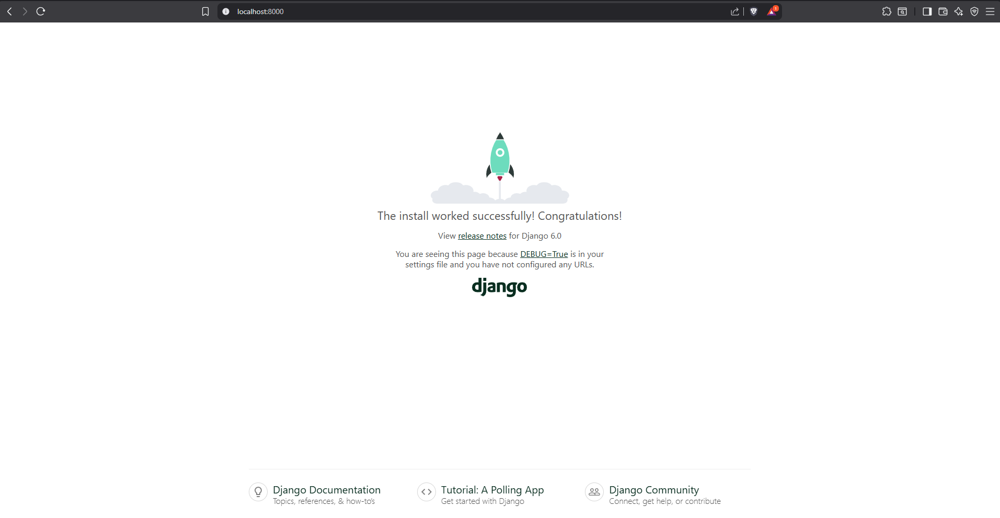
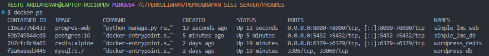
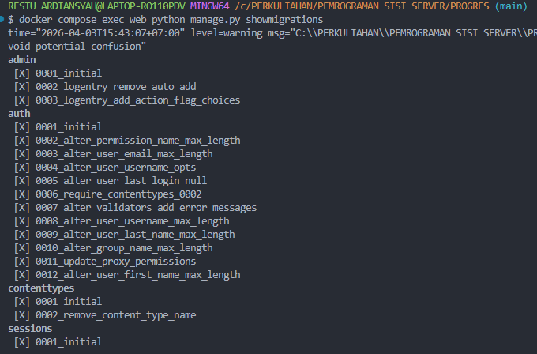

# Simple LMS Docker Compose

## Langkah Pengerjaan

### 1. Menjalankan Docker
Buka terminal di folder project, lalu jalankan:

` docker compose up -d `

### 2. Verifikasi Container
Pastikan kedua container (**Django Web** dan **PostgreSQL**) sudah berjalan:

` docker ps `

### 3. Menjalankan Migration
Jalankan migration untuk membuat tabel bawaan Django di PostgreSQL:

` docker compose exec web python manage.py migrate `

### 4. Akses Django Welcome Page
Buka browser lalu akses alamat berikut:

http://localhost:8000

Jika berhasil, akan muncul halaman:

` The install worked successfully! Congratulations! `

## Env

Gunakan file `.env` sebagai template konfigurasi environment:

```env
DEBUG=True
SECRET_KEY=django-secret-key
DB_NAME=simple_lms
DB_USER=postgres
DB_PASSWORD=postgres
DB_HOST=db
DB_PORT=5432
```

Keterangan:
- `DEBUG`  mode development Django
- `SECRET_KEY`  secret key project
- `DB_NAME`  nama database PostgreSQL
- `DB_USER`  username PostgreSQL
- `DB_PASSWORD`  password PostgreSQL
- `DB_HOST`  hostname service database di Docker
- `DB_PORT`  port PostgreSQL


## Lampiran

### 1. Django Welcome Page


### 2. Verifikasi Container


### 3. Verifikasi Migration PostgreSQL
Perintah:

` docker compose exec web python manage.py showmigrations `

Output akan menampilkan daftar migration seperti:

` admin, auth, contenttypes, sessions `




## Jawaban Pertanyaan

### 1. Kenapa menggunakan Docker untuk development?
Docker membuat environment development menjadi konsisten di semua perangkat. Versi Python, Django, dan PostgreSQL akan selalu sama sehingga mengurangi masalah “works on my machine”.

### 2. Apa fungsi Dockerfile?
Dockerfile digunakan untuk mendefinisikan image aplikasi Django, mulai dari base image Python, install dependency, copy source code, hingga command menjalankan server.

### 3. Apa fungsi docker-compose.yml?
`docker-compose.yml` digunakan untuk menjalankan banyak service sekaligus, dalam project ini:
- **web**  Django application
- **db** PostgreSQL database

Dengan satu perintah `docker compose up -d`, semua service langsung berjalan.

### 4. Bagaimana Django connect ke PostgreSQL?
Django terhubung ke PostgreSQL melalui hostname `db`, yaitu nama service database pada `docker-compose.yml`. Docker otomatis menyediakan internal DNS sehingga container web bisa langsung mengakses database.

### 5. Kenapa menggunakan environment variables?
Environment variables digunakan agar konfigurasi sensitif seperti password database tidak ditulis langsung di source code. Cara ini termasuk best practice dan memudahkan deployment ke production.