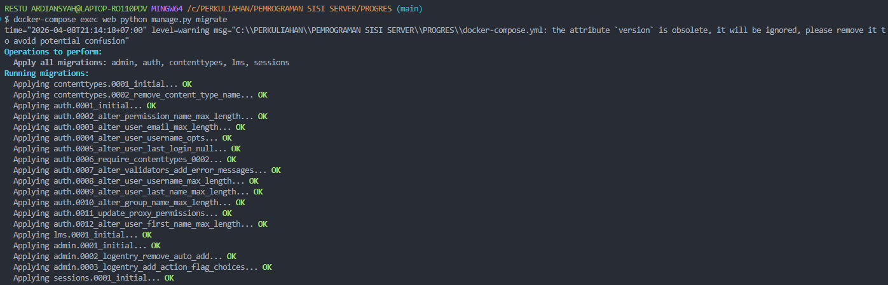
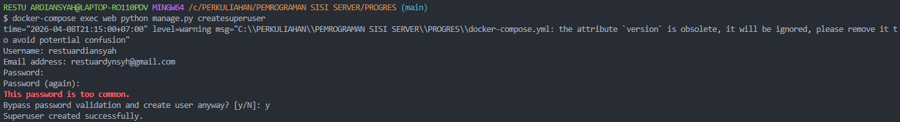
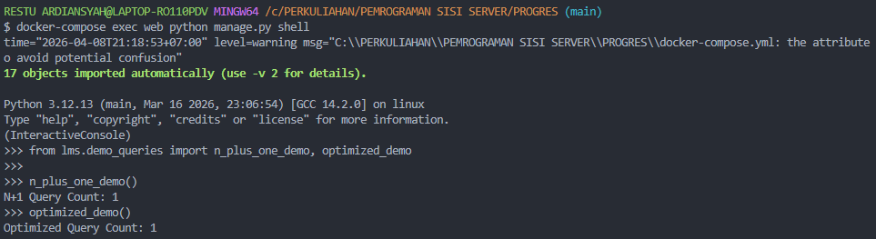
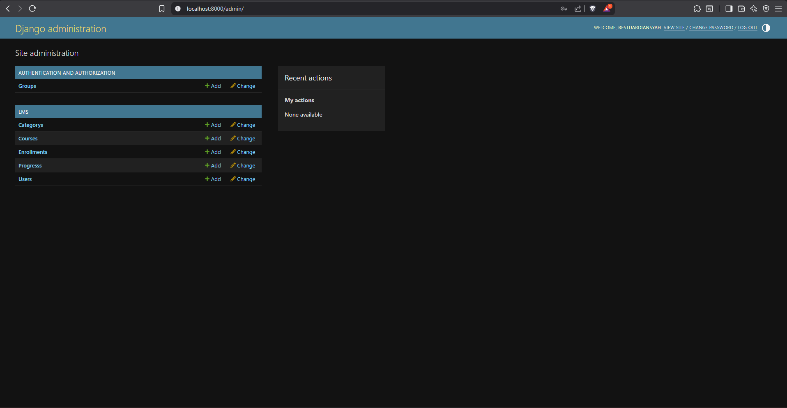
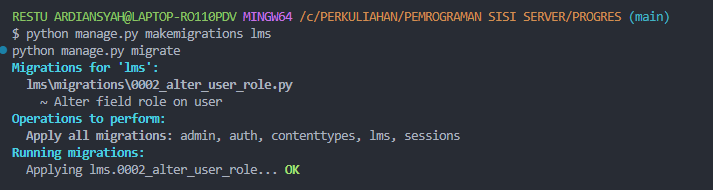

# Progress 1: Simple LMS - Docker & Django Foundation

## Langkah Pengerjaan

### 1. Menjalankan Docker
Buka terminal di folder project, lalu jalankan:

` docker compose up -d `

### 2. Verifikasi Container
Pastikan kedua container (**Django Web** dan **PostgreSQL**) sudah berjalan:

` docker ps `

### 3. Menjalankan Migration
Jalankan migration untuk membuat tabel bawaan Django di PostgreSQL:

` docker compose exec web python manage.py migrate `

### 4. Akses Django Welcome Page
Buka browser lalu akses alamat berikut:

http://localhost:8000

Jika berhasil, akan muncul halaman:

` The install worked successfully! Congratulations! `

## Env

Gunakan file `.env` sebagai template konfigurasi environment:

```env
DEBUG=True
SECRET_KEY=django-secret-key
DB_NAME=simple_lms
DB_USER=postgres
DB_PASSWORD=postgres
DB_HOST=db
DB_PORT=5432
```

Keterangan:
- `DEBUG`  mode development Django
- `SECRET_KEY`  secret key project
- `DB_NAME`  nama database PostgreSQL
- `DB_USER`  username PostgreSQL
- `DB_PASSWORD`  password PostgreSQL
- `DB_HOST`  hostname service database di Docker
- `DB_PORT`  port PostgreSQL


## Lampiran

### 1. Django Welcome Page


### 2. Verifikasi Container


### 3. Verifikasi Migration PostgreSQL
Perintah:

` docker compose exec web python manage.py showmigrations `

Output akan menampilkan daftar migration seperti:

` admin, auth, contenttypes, sessions `


## Jawaban Pertanyaan

### 1. Kenapa menggunakan Docker untuk development?
Docker membuat environment development menjadi konsisten di semua perangkat. Versi Python, Django, dan PostgreSQL akan selalu sama sehingga mengurangi masalah “works on my machine”.

### 2. Apa fungsi Dockerfile?
Dockerfile digunakan untuk mendefinisikan image aplikasi Django, mulai dari base image Python, install dependency, copy source code, hingga command menjalankan server.

### 3. Apa fungsi docker-compose.yml?
`docker-compose.yml` digunakan untuk menjalankan banyak service sekaligus, dalam project ini:
- **web**  Django application
- **db** PostgreSQL database

Dengan satu perintah `docker compose up -d`, semua service langsung berjalan.

### 4. Bagaimana Django connect ke PostgreSQL?
Django terhubung ke PostgreSQL melalui hostname `db`, yaitu nama service database pada `docker-compose.yml`. Docker otomatis menyediakan internal DNS sehingga container web bisa langsung mengakses database.

### 5. Kenapa menggunakan environment variables?
Environment variables digunakan agar konfigurasi sensitif seperti password database tidak ditulis langsung di source code. Cara ini termasuk best practice dan memudahkan deployment ke production.

-------

# Progress 2: Simple LMS - Database Design & ORM Implementation

Pada progress ini, project Simple LMS dikembangkan dengan fokus pada **desain database menggunakan Django ORM**, pengelolaan relasi antar model, serta optimasi query untuk meningkatkan performa aplikasi.

## Fitur yang Diimplementasikan
- **User**
  - Menggunakan custom user model
  - Mendukung role: `admin`, `instructor`, dan `student`

- **Category**
  - Menggunakan relasi self-reference untuk mendukung kategori bertingkat

- **Course**
  - Terhubung ke instructor dan category
  - Mendukung optimasi query untuk kebutuhan list halaman course

- **Lesson**
  - Terhubung ke course
  - Memiliki field `order` untuk urutan materi

- **Enrollment**
  - Relasi student ke course
  - Dilengkapi unique constraint agar student tidak bisa mendaftar course yang sama dua kali

- **Progress**
  - Digunakan untuk tracking penyelesaian lesson oleh student

## Query Optimization
Optimasi query diterapkan menggunakan:
- `select_related()` -> untuk ForeignKey relation
- `prefetch_related()` -> untuk reverse relation
- custom QuerySet manager untuk reusable query optimization

File demo optimasi tersedia pada:
` lms/demo_queries.py `

## Lampiran screenshot hasil implementasi model dan optimasi query:

### 1. Migrasi



### 2. Create User


### 3. Django Shell


### 4. http://localhost:8000/admin/


-------

# Progress 3: Simple LMS - REST API & Authentication System

Pada progress ini, project Simple LMS dikembangkan menjadi **REST API lengkap** menggunakan **Django Ninja**. Fokus utama adalah implementasi keamanan menggunakan **JWT Authentication**, validasi data dengan **Pydantic Schemas**, dan pembatasan akses berbasis peran (**RBAC**).

## Fitur yang Diimplementasikan

- **Authentication System (JWT)**
  - Register user baru dengan role spesifik.
  - Login sistem menggunakan Access & Refresh Token.
  - Update profil dan proteksi endpoint `/auth/me`.

- **Role-Based Access Control (RBAC)**
  - Implementasi custom decorators: `@is_instructor`, `@is_admin`, dan `@is_student`.
  - Pembatasan akses API berdasarkan peran pengguna.

- **Course Management**
  - **Public:** List course dengan fitur *pagination* dan *search filtering*.
  - **Instructor:** Membuat dan memperbarui course (dengan validasi kepemilikan/ownership).
  - **Admin:** Otoritas penuh untuk menghapus course.

- **Enrollment & Progress Tracking**
  - Student dapat mendaftar ke course.
  - Tracking progres belajar dengan menandai lesson sebagai "Complete".

- **API Documentation**
  - Dokumentasi otomatis menggunakan **Swagger UI** yang dapat diakses secara interaktif.

## Teknologi & Library
- **Django Ninja**: Framework API cepat dengan tipe data Python.
- **Django Ninja JWT**: Handler untuk JSON Web Token.
- **Pydantic**: Schema validation untuk input dan output data.

## Cara Menjalankan API
1. Pastikan database sudah dimigrasi:
  
   ` python manage.py makemigrations lms ` dan ` python manage.py migrate  ` 

   

2. Jalankan Server

   ` python manage.py runserver ` 

   

3. Akses dokumentasi API di: http://127.0.0.1:8000/api/docs

   

4. Regrister/Auth 

   

5. Postman Colection

   
